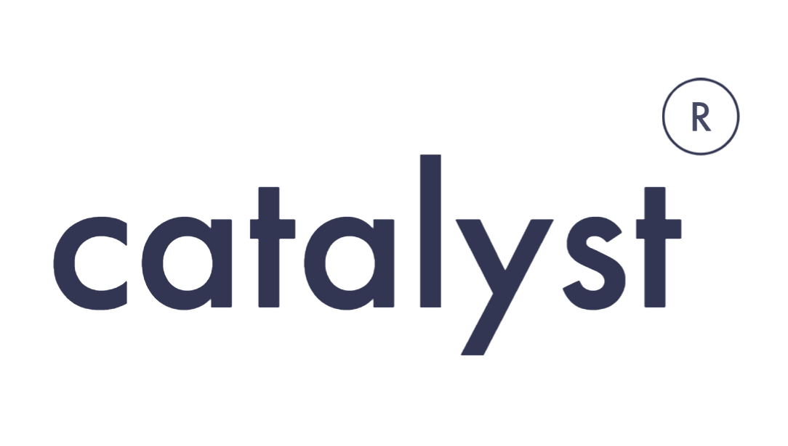

<!DOCTYPE html>
<html lang="">
    <head>
        <meta charset="utf-8">
        <meta http-equiv="X-UA-Compatible" content="IE=edge">
        <meta name="viewport" content="width=device-width, initial-scale=1">
        <title>Catalyst</title>
        <link rel="shortcut icon" href="logo.png" type="image/x-icon">
        <link rel="stylesheet" href="https://cdnjs.cloudflare.com/ajax/libs/bulma/0.9.4/css/bulma.css" />
        <link rel="stylesheet" href="https://cdnjs.cloudflare.com/ajax/libs/font-awesome/6.2.1/css/all.min.css" integrity="sha512-MV7K8+y+gLIBoVD59lQIYicR65iaqukzvf/nwasF0nqhPay5w/9lJmVM2hMDcnK1OnMGCdVK+iQrJ7lzPJQd1w==" crossorigin="anonymous" referrerpolicy="no-referrer" />
        <link rel="stylesheet" href="index.css" />
        
        
    </head>
    <body>
        

            <nav class="navbar" role="navigation" aria-label="main navigation">
                

                    
                    <button class="burger is-active">
                        <i class="fa-solid fa-angle-left"></i>
                    </button>
                    <i class="fa-solid fa-left"></i>
                

                

                    

                        

                            

                                <a class="button navbtn">
                                    Projects
                                </a>
                                <a class="button navbtn">
                                    About Us
                                </a>
                                <a class="button navbtn">
                                    <i class="fa-brands fa-whatsapp"></i> &nbsp; App Us
                                </a>
                                <a class="button navbtn">
                                    <i class="fa-brands fa-github"></i> &nbsp; Github
                                </a>
                            

                        

                    

                

            </nav>
            

                <section class="section banner is-large">
                    <h1 class="title">We are Catalyst</h1>
                    <h2 class="subtitle">
                        Computer solutions providers.
                    </h2>
                    <button class="button is-medium is-responsive bannerbtn">
                        Visit our works
                    </button>
                </section>
            

        

    </body>
    
</html>
